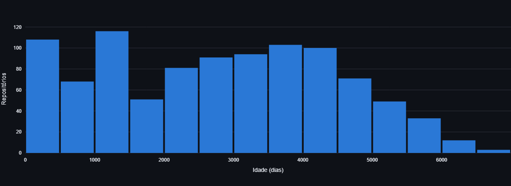
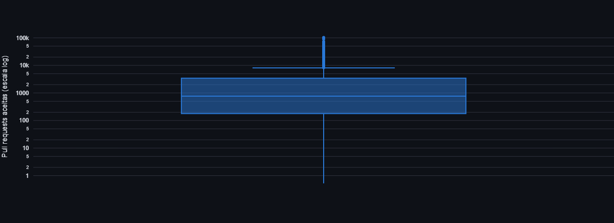
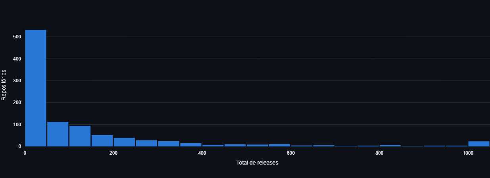
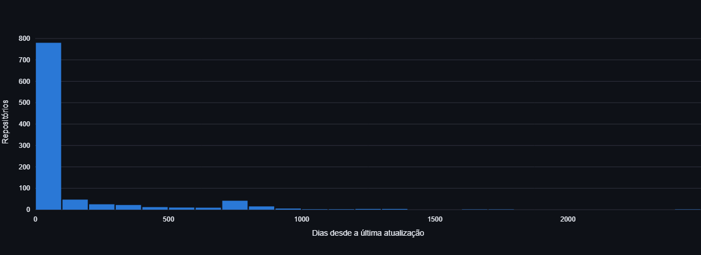
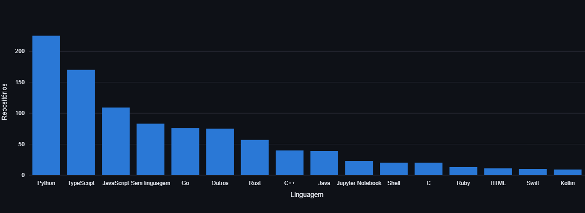
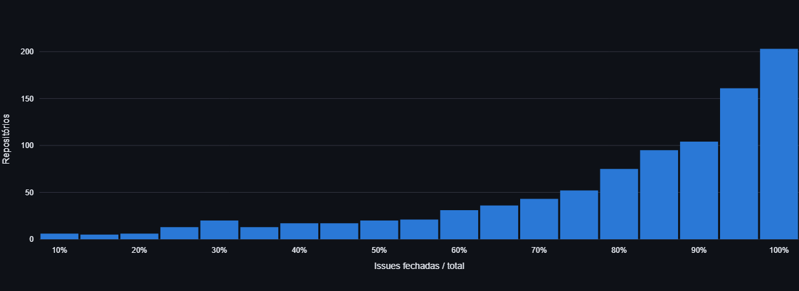
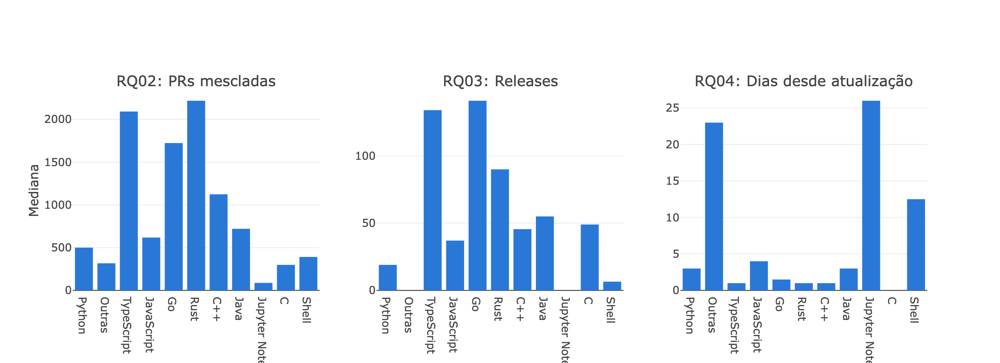
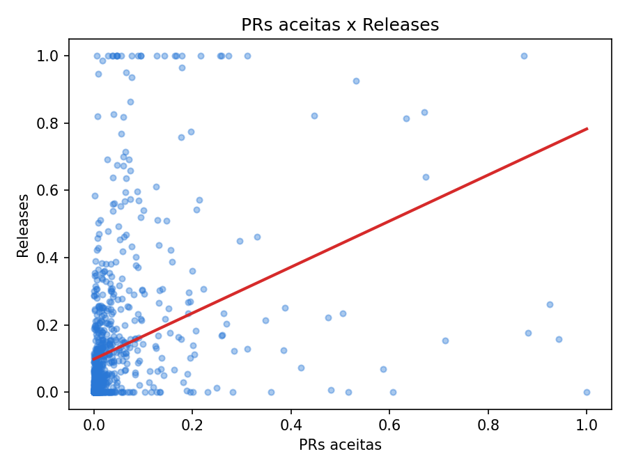
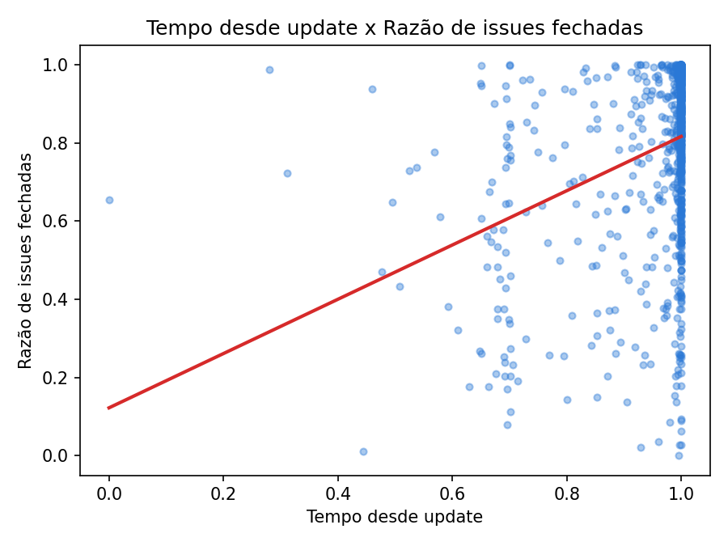
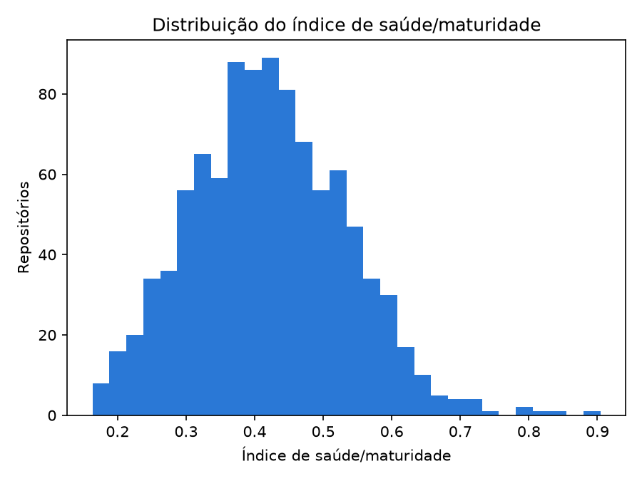

# Relatório de Laboratório

*Laboratório de Experimentação de Software — Modelo/Template de Relatório*

Este documento é um MODELO válido para qualquer um dos 5 laboratórios da disciplina (Lab01 a Lab05). Os parágrafos em itálico cinza/verde, iniciados por "ORIENTAÇÃO", explicam o que cada subseção deve conter — apague-os e escreva o conteúdo real do grupo no lugar. Textos entre colchetes [assim] indicam onde inserir informação específica do seu grupo/laboratório.

| | |
|---|---|
| **Curso** | Engenharia de Software |
| **Disciplina** | Laboratório de Experimentação de Software |
| **Turno / Período** | Noite / 6º |
| **Professor(a)** | Danilo Maia |
| **Laboratório** | [Lab01 — Repositórios Populares] |
| **Grupo (trio)** | Arthur Lara Panzera · Felipe Augusto Pereira · Gabriel Reis Lebron |
| **Link do repositório / GitHub Projects** | https://github.com/GabrielReiiss/Lab-ExperimentacaoDeSoftware |
| **Data de entrega** | 26/08/2026 |

---

## 1. Introdução

Repositórios populares no GitHub concentram grande parte da atenção da comunidade open-source: costumam ser referência de qualidade, atraem contribuidores e influenciam práticas adotadas pelo mercado. Apesar disso, o que de fato caracteriza esses repositórios (se são maduros, bem mantidos, concentrados em poucas linguagens, ou geridos com algum rigor de processo) raramente é medido de forma sistemática, ficando mais no campo da percepção do que da evidência. Este trabalho caracteriza empiricamente os 1.000 repositórios open-source mais populares do GitHub por número de estrelas, a partir de dados coletados via API GraphQL do GitHub, para verificar se essas percepções comuns se sustentam nos dados coletados.

Essa caracterização importa tanto para a engenharia de software, que ganha evidência sobre práticas associadas a projetos populares (cadência de release, resposta a issues, frequência de atualização), quanto para o próprio grupo, que usa o exercício para praticar coleta de dados em escala via API, tratamento de valores ausentes e outliers, e comunicação de resultados estatísticos.

A caracterização é guiada por sete questões de pesquisa do enunciado, RQ01 a RQ07:

- **RQ01**: Sistemas populares são maduros/antigos?
    - métrica: idade do repositório.
- **RQ02**: Sistemas populares recebem muita contribuição externa?
    - métrica: total de pull requests mescladas.
- **RQ03**: Sistemas populares lançam releases com frequência?
    - métrica: total de releases.
- **RQ04**: Sistemas populares são atualizados com frequência?
    - métrica: tempo até a última atualização.
- **RQ05**: Sistemas populares são escritos nas linguagens mais populares?
    - métrica: linguagem primária de cada repositório.
- **RQ06**: Sistemas populares possuem um alto percentual de issues fechadas?
    - métrica: razão entre issues fechadas e total de issues.
- **RQ07**: Sistemas escritos nas linguagens mais populares recebem mais contribuição externa, lançam mais releases e são atualizados com mais frequência?
    - métrica: RQ02, RQ03 e RQ04 agrupadas pela linguagem da RQ05.

**Hipóteses informais**, formuladas pelo grupo antes da análise formal dos dados:

- **RQ01**: esperamos que repositórios populares sejam majoritariamente antigos, já que acumular um número alto de estrelas costuma exigir tempo de exposição e uso contínuo pela comunidade, tornando repositórios muito recentes uma minoria entre os mais populares.
- **RQ02**: esperamos que repositórios populares recebam contribuição externa significativa, medida pelo número de pull requests mescladas, dado que maior visibilidade tende a atrair mais colaboradores dispostos a propor mudanças.
- **RQ03**: esperamos que repositórios populares lancem releases com frequência regular, já que projetos com muita visibilidade tendem a ter ciclos de desenvolvimento mais estruturados e cadência de versionamento previsível.
- **RQ04**: esperamos que repositórios populares sejam atualizados com frequência alta, dado que atraem mais colaboradores e exigem manutenção constante para sustentar a base de usuários.
- **RQ05**: esperamos que a maioria dos repositórios populares esteja concentrada nas linguagens de propósito geral mais usadas do mercado (ex.: JavaScript/TypeScript, Python, Java), já que essas linguagens têm o maior número de desenvolvedores e ecossistemas mais maduros para projetos open-source de grande escala. Fonte adotada para "linguagens mais populares": GitHub Octoverse 2025, detalhada na seção 2.
- **RQ06**: esperamos que repositórios populares tenham uma alta taxa de issues fechadas, já que a visibilidade atrai mantenedores e contribuidores que respondem e resolvem problemas relatados com mais agilidade.
- **RQ07**: esperamos que repositórios escritos nas linguagens mais populares recebam mais contribuição externa, lancem mais releases e sejam atualizados com mais frequência do que os demais, já que ecossistemas de linguagem maiores tendem a atrair mais desenvolvedores e ferramentas de automação de build e release.

**Inovações do grupo (30% da nota)**, detalhadas na Metodologia (seção 3.6):

- Análise de correlação (Pearson e Spearman) entre as seis métricas normalizadas de RQ01-RQ06, para verificar se alguma delas é redundante o suficiente para ser descartada.
- Índice composto de saúde/maturidade do repositório, combinando as seis métricas normalizadas por média ponderada num único score por repositório.

## 2. Contexto

*ORIENTAÇÃO: Situe o leitor no cenário do estudo. Primeiro, o contexto acadêmico: em qual momento do semestre este laboratório se encontra e como ele se conecta aos anteriores (ex.: "este é o Lab04, que consome os dados de mineração do Lab03 e os snapshots do Kanban mantidos desde o Lab01"). Segundo, o contexto do objeto de estudo em si: o que exatamente está sendo medido (os 1.000 repositórios mais populares do GitHub — Lab01; o processo de resolução de katas com e sem IA — Lab02; repositórios com CI/CD via GitHub Actions — Lab03; o board Kanban do próprio grupo — Lab04/Lab05). Cite aqui referências conceituais relevantes usadas como base teórica (ex.: o livro Accelerate, de Forsgren, Humble & Kim, para métricas DORA; o método GQM de Basili, Caldiera & Rombach para o meta-laboratório; o índice usado para "linguagens mais populares" no Lab01 — TIOBE, GitHut ou GitHub Octoverse, mantendo a mesma fonte do início ao fim).*

*[conteúdo do grupo — substituir este texto]*

## 3. Metodologia

*ORIENTAÇÃO: Esta é a seção mais longa do relatório e a que mais evidencia o trabalho real do grupo. Ela tem seis subseções — as cinco primeiras cobrem principalmente os 70% do enunciado; a última (Inovações) é onde os 30% de contribuição própria do grupo devem ficar explícitos e fáceis de identificar na correção.*

### 3.1 Principais Desafios

**Erro 502 dependente do tamanho da página, não do volume total.** A query GraphQL única (RQ01-06) traz, por repositório, campos caros de computar do lado do GitHub: `pullRequests(states: MERGED)`, `releases` e duas contagens de `issues` (`closedIssues`/`totalIssues`). Testamos empiricamente contra a API real: com `first=10` a consulta sempre funcionava; com `first=50` ela falhava com `502 Bad Gateway` de forma consistente, nas 3 tentativas de retry, com a mesma mensagem a cada vez. Isso descartou a hipótese de instabilidade de rede aleatória, o problema era o **custo da consulta por requisição** (o servidor do GitHub expira antes de terminar de computar as contagens de issues pra muitos repositórios de uma vez), não *rate limit* nem falha transiente. A evidência decisiva foi justamente essa: um erro transiente de rede não se repetiria de forma idêntica a cada nova tentativa.

**Retry sozinho não resolve falha determinística.** A primeira tentativa de correção foi adicionar retry com backoff (3 tentativas) no client. Isso resolveu falhas de rede genuinamente transientes, mas não teve efeito nenhum sobre o 502 de custo, como o motivo da falha não muda entre tentativas, tentar de novo com o mesmo `page_size` simplesmente reproduz o mesmo erro 3 vezes seguidas antes de desistir.

**Esgotamento de conexões TCP/portas na paginação de 1000 repositórios.** A implementação inicial do client abria uma conexão nova a cada chamada (`requests.post(...)` direto, sem reaproveitar socket). Ao paginar rapidamente as dezenas de requisições necessárias pra coletar os 1.000 repositórios, isso esgotava as portas efêmeras disponíveis no sistema operacional, causando falhas de "Failed to establish a new connection" mesmo com token e rede válidos, um problema de recurso do lado do cliente, não da API do GitHub.

**Falha de rede que só aparece em escala grande.** Durante o benchmark de paginação em N=1.000 (ver 3.6/4.6), a coleta quebrou com `ChunkedEncodingError` (conexão cortada no meio do corpo da resposta), um tipo de erro que não havia aparecido nos testes em N=100 nem N=500, nem no desenvolvimento original do client. Nem `run_query` nem `paginate()` tratavam esse erro como transitório, então ele derrubava a coleta inteira em vez de contar como uma falha de página recuperável (como já acontecia com timeout e erro de conexão). Reforça que testar só em volume pequeno não é suficiente para expor todos os modos de falha da API em produção.

**Retry duplicado em duas camadas, sem coordenação.** Antes das correções ao script, a paginação adaptativa era 2-4x mais lenta que a fixa segura (seção 4.6), investigamos a causa em vez de aceitar o número. Diagnóstico instrumentado (`scripts/diagnose_adaptive.py`) mostrou que, pra cada falha que o `paginate()` contava (`falha 1/3`, `2/3`, `3/3`), o `run_query()` já tinha tentado 3x sozinho, 9 requisições HTTP reais pra uma única decisão de encolher o `page_size`. Como requisições que falham demoram mais, em média, que as bem-sucedidas (o gateway do GitHub demora a desistir da query cara), isso dominava o tempo total: 66% de uma execução de N=100 era gasto em requisições que falhavam.

*(fonte: commits `ae4becc` e `38ca65d` do repositório do grupo; benchmark e diagnóstico em `docs/benchmark_pagination.md`)*

### 3.2 Tomadas de Decisão

**Reaproveitar uma única `requests.Session()` em vez de abrir uma conexão por chamada.** Trade-off: um pouco mais de estado global no módulo do client, em troca de eliminar o esgotamento de portas TCP descrito em 3.1, a sessão faz *connection pooling*/*keep-alive*, reaproveitando os mesmos sockets entre requisições em vez de abrir e derrubar um por chamada.

**`page_size` adaptativo em vez de um valor fixo "seguro".** Em vez de simplesmente fixar um `page_size` pequeno o bastante pra nunca dar 502 (o que deixaria a coleta de 1.000 repositórios desnecessariamente lenta o tempo todo), o `paginate()` ajusta o tamanho da página durante a própria execução: cresce +5 repositórios por página após 3 páginas seguidas bem-sucedidas (até o teto de 100 imposto pela API), e encolhe -5 após 3 falhas seguidas (mínimo de 5). O valor que causou a última sequência de falhas vira um "teto" temporário, pra evitar ficar oscilando entre crescer e cair de volta no mesmo valor ruim (*flapping*), esse teto é perdoado depois de algumas rodadas estáveis, permitindo tentar crescer de novo caso a instabilidade do lado do servidor tenha passado. Trade-off: mais complexidade no client em troca de não precisar escolher manualmente, por tentativa e erro, um `page_size` fixo pra cada volume de coleta.

**Retry limitado a erros claramente transitórios e removido de onde não ajudava.** O client tenta de novo (3x, com backoff) em timeout, erro de conexão, conexão cortada no meio da resposta e corpo de resposta JSON inválido, não em erros de query (`GraphQLError`) nem em erros de autenticação, decisão deliberada pra não mascarar um erro de configuração atrás de retries. **502/503/504 foram removidos do retry do `run_query()`** depois do diagnóstico descrito em 3.1: como esse erro é determinístico por custo de consulta, retentar a mesma requisição sem mudar nada não resolve, só quem sabe *o que* mudar (o `paginate()`, reduzindo o `page_size`) deveria reagir a ele. Medido: essa remoção sozinha cortou o tempo da paginação adaptativa pela metade (de ~4x pra ~2x mais lenta que a fixa segura, em N=100 — ver `docs/benchmark_pagination.md`).

**Mesmo padrão de desperdício, encontrado de novo uma camada acima.** O `paginate()` exigia 3 falhas seguidas no mesmo `page_size` antes de encolher (`FAILURE_STREAK_TO_SHRINK=3`), a mesma lógica de "confirmar antes de agir" que já tínhamos corrigido no `run_query()`, só que agora dentro do próprio `paginate()`. Reduzido pra 1 falha. Medido (N=100, 2 execuções de confirmação): média de ~26% mais rápido (93,9s → 69,1s). Amostra pequena (2 execuções), mas nas duas direções o resultado foi consistente, ver `docs/benchmark_pagination.md` pra números e a ressalva completa.

**Critério de amostragem: `stars:>1 sort:stars-desc`.** Excluímos repositórios com 0 ou 1 estrela (ruído/lixo no ranking) e ordenamos de forma decrescente por estrelas, garantindo que a amostra coletada corresponda de fato aos repositórios mais populares, e não a uma amostra aleatória dentro do universo de busca.

**Limite de WIP da coluna Doing: 3** (uma Issue por integrante do trio). Justificativa: com um limite igual ao número de integrantes, cada pessoa mantém no máximo uma tarefa em andamento por vez, o que facilita controlar o fluxo de Issues sendo movidas de Doing para Review, evitando que várias tarefas fiquem abertas em paralelo pela mesma pessoa sem terminar nenhuma, e torna imediato perceber quando alguém está com a coluna "cheia" e precisa finalizar ou revisar antes de puxar a próxima.

### 3.3 Etapas

| Sprint | Entregas | Responsável(is) | Issues (nº) |
|---|---|---|---|
| **Lab01S01** | Arquitetura base do client GraphQL; consulta unificada RQ01-06 para 100 repositórios; script único de consulta do grupo; padronização da estrutura de código | Felipe Pereira, Arthur Panzera, Gabriel Reis | #1 #2 #3 #4 #5 #6 #7 #8 #15 |
| **Lab01S02** | Paginação adaptativa para 1.000 repositórios; exportação em CSV; validação + hipótese informal por RQ; primeiro snapshot de sprint; arquitetura e primeira versão do dashboard Streamlit; comparador individual vs. população | Felipe Pereira, Arthur Panzera, Gabriel Reis | #19 #20 #21 #22 #23 #24 #25 #29 #30 #31 |
| **Lab01S03** | Análise e gráficos por RQ (RQ01/02, RQ03/04, RQ05/06, RQ07); segundo snapshot de sprint; inovações (correlação entre métricas, índice composto) | Felipe Pereira, Arthur Panzera, Gabriel Reis | #33 #34 #43 #44 #45 #46 #47 |
| **Relatório Final** | Elaboração do documento final (metodologia, resultados por RQ, discussão, configuração do processo, revisão) | Felipe Pereira, Arthur Panzera, Gabriel Reis | #49 #50 #51 #52 #53 #54 |

#### Configuração do processo

- **Colunas do board:** `[confirmar - mínimo Backlog → To Do → Doing → Review → Done]`
- **Limite de WIP (coluna Doing):** 3 - uma Issue por integrante do trio, controlando o fluxo de Doing para Review (ver justificativa completa em 3.2)
- **Print do board:** `[inserir captura de tela do board ao final do Lab01, mostrando o fluxo real de trabalho]`

### 3.4 Ferramentas

| Etapa | Ferramenta |
|---|---|
| Mineração de dados | API GraphQL do GitHub, consumida por um client próprio do grupo (`src/github_client/`) construído sobre `requests`, sem bibliotecas de terceiros que abstraem a API |
| Manipulação/análise de dados | Python 3.12, Pandas |
| Visualização/dashboard | Plotly (gráficos), Streamlit (dashboard interativo com múltiplas páginas) |
| Exportação de dados | CSV (`src/export/csv_writer.py`) |
| Testes automatizados | pytest |
| Processo | GitHub Projects (v2) - link do repositório na tabela do cabeçalho deste documento |

### 3.5 Tabela de Métricas

| RQ | Métrica | Definição Operacional | Unidade | Ferramenta / Fonte |
|---|---|---|---|---|
| RQ01 | Idade do repositório | Data atual − `createdAt` do repositório | Dias | Script GraphQL próprio (API do GitHub) |
| RQ02 | Contribuição externa | `pullRequests(states: MERGED).totalCount` | PRs mescladas | Script GraphQL próprio (API do GitHub) |
| RQ03 | Frequência de releases | `releases.totalCount` | Releases | Script GraphQL próprio (API do GitHub) |
| RQ04 | Frequência de atualização | Data atual − `pushedAt` (último push) | Dias | Script GraphQL próprio (API do GitHub) |
| RQ05 | Linguagem primária | `primaryLanguage.name`, comparada ao ranking do GitHub Octoverse 2025 | Categórica | Script GraphQL próprio + GitHub Octoverse 2025 |
| RQ06 | Percentual de issues fechadas | `issues(states: CLOSED).totalCount / issues.totalCount` | Razão (0-1) | Script GraphQL próprio (API do GitHub) |
| RQ07 | Contribuição/releases/atualização por linguagem | RQ02, RQ03 e RQ04 agrupadas por `primaryLanguage` | Agregado por categoria | Pandas (groupby sobre o CSV coletado) |

### 3.6 Inovações Propostas pelo Grupo (30% da nota)

**Paginação adaptativa em vez de arquitetura de coleta fixa.** Detalhada em 3.1/3.2: o `page_size` cresce/encolhe automaticamente com base em sequências de sucesso/falha da API, em vez de um valor fixo escolhido por tentativa e erro. Além disso foi feito um benchmark comparando com page_size fixo, incluindo diagnóstico, correções de retry duplicado e um teste além do teto de 1.000 via particionamento por faixas de estrelas (`scripts/experimental/collect_beyond_1000.py`, fora do pipeline de produção). Resultados em 4.6 e detalhamento completo em `docs/benchmark_pagination.md`.

**Análise de correlação entre as métricas (`src/analysis/correlation.py`, `scripts/compute_correlations.py`).** Correlação de Pearson e Spearman entre as 6 métricas normalizadas (min-max), vai além do que o enunciado pede (que trata cada RQ isoladamente) e investiga se as métricas se movem juntas (ex.: repositórios com mais PRs também têm releases mais frequentes?). Resultado e interpretação discutidos em 4.4.

**Índice composto de saúde/maturidade do repositório (`src/analysis/health_index.py`, `scripts/compute_health_index.py`).** Combina as 6 métricas normalizadas num score único de 0 a 1, por média ponderada (PRs aceitas com maior peso por ser o sinal mais direto de colaboração externa; issues fechadas com menor peso por variar muito entre processos de projeto), permitindo ranquear os repositórios por maturidade geral em vez de métrica por métrica. Resultado discutido em 4.3.

**Comparador individual vs. população (dashboard).** Permite posicionar um repositório específico em percentil, em cada uma das 6 métricas, em relação aos outros 999 da amostra, uma forma alternativa de apresentar os mesmos dados, focada em leitura individual em vez de agregada.

## 4. Resultados

### 4.1 Coleta de Dados

A coleta mais recente reúne 980 dos 1.000 repositórios-alvo (23/08/2026), buscados via GraphQL pelo número de estrelas. A diferença para a meta é esperada: falhas transitórias de rede/timeout na API do GitHub descartam páginas isoladas da paginação sem interromper a coleta, e o próprio ranking de estrelas muda um pouco a cada execução do script.

Das seis métricas usadas para responder as RQs, quatro não têm nenhum valor ausente porque derivam de campos sempre presentes na API (data de criação, data do último push, contagens diretas). As outras duas têm ausência real, documentada e não preenchida artificialmente:

| RQ | Métrica | Válidos | Ausentes | % ausentes | Motivo da ausência |
|---|---|---|---|---|---|
| RQ01 | Idade (dias) | 980 | 0 | 0% | — |
| RQ02 | PRs mescladas | 980 | 0 | 0% | — |
| RQ03 | Releases | 980 | 0 | 0% | — |
| RQ04 | Dias desde atualização | 980 | 0 | 0% | — |
| RQ05 | Linguagem primária | 897 | 83 | 8,5% | Repositório sem código-fonte majoritário (ex.: listas de recursos, e-books) |
| RQ06 | Razão de issues fechadas | 938 | 42 | 4,3% | Repositório sem nenhuma issue registrada (rastreador desligado ou não usado) |

Três grupos de outliers foram identificados e mantidos na amostra, com a ressalva discutida na seção 4.3: `firstcontributions/first-contributions`, com 103.516 PRs mescladas (repositório-tutorial, não comparável a projetos reais); 23 repositórios com exatamente 1000 releases, teto conhecido do campo na API do GitHub (confirmado à parte para o `electron`, que tem 1981 releases reais); e 26 repositórios com razão de issues fechadas de exatamente 100%.

A RQ07 não é uma métrica coletada à parte — é RQ02, RQ03 e RQ04 agrupadas pela linguagem da RQ05, então não tem linha própria na tabela acima. Ela usa a amostra completa de 980 repositórios sem perder nenhum: os 83 sem linguagem detectada (já contados na ausência da RQ05) não são excluídos do agrupamento, entram na categoria "Outras" junto com as linguagens de baixa frequência.

### 4.2 Visualização Gráfica

Os sete gráficos abaixo são gerados dinamicamente pelo Dashboard Exploratório, recalculados conforme os filtros de linguagem, estrelas e idade aplicados pelo usuário. Os valores citados em texto correspondem à amostra completa (980 repositórios), sem filtro.

**RQ01 — Sistemas populares são maduros/antigos?**
Histograma da idade dos repositórios, em dias desde a criação. Mediana de 2834 dias (~7,8 anos), variando de 10 a 6708 dias (~18,4 anos). Os cinco repositórios mais antigos da amostra são `rails`, `git`, `jekyll`, `redis` e `jquery`, todos criados entre 2008 e 2009.

**RQ02 — Sistemas populares recebem muita contribuição externa?**
Boxplot (escala logarítmica) do total de pull requests mescladas. Mediana de 768 PRs. 19 repositórios (1,9%) aparecem com zero PRs, incluindo `torvalds/linux` e `FFmpeg/FFmpeg`, que usam fluxo de contribuição por lista de e-mail em vez de pull request do GitHub.

**RQ03 — Sistemas populares lançam releases com frequência?**
Histograma do total de releases. Mediana geral de 37,5 releases; considerando só quem lança ao menos uma release, a mediana sobe para 95. 288 repositórios (29,4%) não têm nenhuma release.

**RQ04 — Sistemas populares são atualizados com frequência?**
Histograma dos dias desde a última atualização. Mediana de 2 dias; 305 repositórios (31,1%) foram atualizados no mesmo dia da coleta. 114 repositórios (11,6%) estão parados há mais de um ano, o caso mais extremo com 2455 dias (~6,7 anos) sem atualização.

**RQ05 — Sistemas populares são escritos nas linguagens mais populares?**
Gráfico de barras da distribuição de linguagens primárias, comparada ao ranking GitHub Octoverse 2025. 43 linguagens distintas identificadas. Top 3: Python (23,0%), TypeScript (17,3%) e JavaScript (11,1%), 51,4% acumulado.

**RQ06 — Sistemas populares possuem um alto percentual de issues fechadas?**
Histograma da razão entre issues fechadas e total de issues. Mediana de 87,5%, mínimo de 7,6%, máximo de 100%.

**RQ07 — Sistemas escritos em linguagens mais populares recebem mais contribuição externa, lançam mais releases e são atualizados com mais frequência?**
Três gráficos de barras (PRs mescladas, releases e dias desde atualização, cada um com mediana por linguagem, top 10 + "Outras"). Comparando as 5 linguagens do GitHub Octoverse 2025 (TypeScript, Python, JavaScript, Java, C#) contra o restante: mediana de 912 PRs mescladas contra 646, 50 releases contra 27, e 2 dias desde a última atualização contra 3. Rust (2217) e TypeScript (2091) têm a maior mediana de PRs mescladas entre todas as linguagens, acima até de Python (500), a mais frequente na amostra.

### 4.3 Discussão

**RQ01 — hipótese confirmada.** A mediana de ~7,8 anos e a concentração dos cinco repositórios mais antigos (2008-2009) entre os mais populares sustentam a expectativa de que popularidade se acumula ao longo do tempo. Ressalva: existe uma cauda de repositórios recém-criados (o mais novo tem 10 dias de existência), sinal de que picos de interesse pontuais, como lançamentos ligados a IA, também conseguem entrar rapidamente no top 1000, sem esperar anos de exposição.

**RQ02 — hipótese confirmada.** A mediana de 768 PRs mescladas indica volume relevante de contribuição externa. Ameaça à validade: a métrica subestima colaboração em projetos que não usam o fluxo de pull request do GitHub (`linux`, `FFmpeg`, zero PRs registrados apesar de serem projetos ativos), e o outlier `first-contributions` (103.516 PRs, repositório-tutorial) precisa ser excluído de qualquer análise agregada por média, sob risco de distorcer a conclusão.

**RQ03 — hipótese parcialmente confirmada.** A mediana condicionada a quem lança ao menos uma release (95) sustenta a ideia de cadência estruturada entre quem usa o recurso, mas 29,4% da amostra não lança nenhuma release, contrariando a expectativa de que a maioria adotaria ciclos formais de versionamento (muitos desses são listas de recursos ou material de referência, que popularizam sem seguir um processo de release tradicional). O teto de 1000 no campo, confirmado à parte para o `electron`, é uma ameaça à validade real: a mediana geral (37,5) é subestimada para os projetos mais ativos, que provavelmente ultrapassam esse valor.

**RQ04 — hipótese confirmada.** A mediana de apenas 2 dias e quase um terço da amostra (31,1%) atualizada no mesmo dia da coleta mostram manutenção ativa na maioria dos projetos populares. A minoria parada há mais de um ano (11,6%) reforça a hipótese em vez de contradizê-la: em geral são materiais de referência estáticos (livros, roadmaps), não projetos de software que exigiam manutenção contínua e a perderam.

**RQ05 — hipótese confirmada parcialmente.** Usando o GitHub Octoverse 2025 como referência, Python, TypeScript e JavaScript concentram 51,4% da amostra e ocupam as três primeiras posições também no ranking de referência, confirmando a expectativa central. Mas a ordem interna diverge (Python é 1º na amostra e 2º na referência) e duas linguagens de peso corporativo no Octoverse, Java (4º na referência, 8º na amostra, 4,0%) e C# (5º na referência, 16º na amostra, 0,8%), aparecem bem abaixo do esperado, indício de que popularidade por estrelas no GitHub favorece ecossistemas de scripting, web e IA mais do que linguagens tipicamente usadas em software corporativo fechado.

**RQ06 — hipótese confirmada.** A mediana de 87,5% de issues fechadas é uma taxa alta, sustentando a expectativa de que repositórios populares recebem atenção de manutenção suficiente para resolver a maioria dos problemas relatados. Ressalva dupla: repositórios sem nenhuma issue registrada (4,3%) ficam fora do cálculo, incluindo casos como o `linux`, que desliga deliberadamente o rastreador de Issues do GitHub; e 2,7% da amostra tem razão de exatamente 100%, incluindo repositórios com milhares de issues todas fechadas, o que sugere bots de triagem automática ou política agressiva de fechamento, não necessariamente resolução manual de cada problema.

**RQ07 — hipótese confirmada.** Repositórios em linguagens populares (top 5 do GitHub Octoverse 2025: TypeScript, Python, JavaScript, Java, C#) superam o restante da amostra nas três métricas: mediana de 912 PRs mescladas contra 646 (+41%), 50 releases contra 27 (quase o dobro), e 2 dias desde a última atualização contra 3. A diferença é mais forte em releases e mais fraca em frequência de atualização, onde a mediana geral já é baixa (2-3 dias) pra quase toda a amostra, sobrando pouca margem pra diferença aparecer. Olhando linguagem a linguagem, não só popular vs. resto, o próprio grupo "popular" está longe de ser uniforme: Rust e TypeScript têm mediana de PRs mescladas (2217 e 2091) bem acima até de Python (500), a linguagem mais frequente da amostra. Ressalva: a comparação é uma correlação, não uma relação causal — linguagens do Octoverse também tendem a pertencer a ecossistemas com mais automação de release (ex.: semantic-release, comum no mundo JS/TS), o que pode explicar parte da diferença em RQ03 independentemente da popularidade da linguagem em si.

**Ameaças à validade gerais.** Os dados são um retrato de um único instante (23/08/2026): o ranking de estrelas, a contagem de releases e a razão de issues fechadas mudam continuamente, então uma nova coleta produz números levemente diferentes dos aqui reportados, como já observado entre coletas anteriores do grupo. O teto de 1000 no campo `releases` e os projetos que não usam o fluxo nativo de pull request do GitHub são limitações da própria API, não do método de coleta do grupo. O Octoverse 2025 mede popularidade de linguagem no GitHub como um todo, não especificamente entre os repositórios mais populares, então a comparação da RQ05 é uma aproximação.

As inovações do grupo, detalhadas na seção 3.6, aprofundam esses resultados combinando as seis métricas num índice único de saúde/maturidade por repositório e cruzando-as par a par numa matriz de correlação; a discussão específica de cada uma é apresentada naquela seção e, em mais detalhe, a seguir em 4.4 (correlação) e 4.5 (índice de saúde/maturidade).

### 4.4 Análise de Correlação entre Métricas

Matriz de correlação de Pearson entre as seis métricas normalizadas por min-max (`update_frequency_days` invertida antes da normalização, como no índice de saúde, de modo que valor alto = atualização mais recente):

| | Idade | PRs aceitas | Releases | Atualização recente | Issues fechadas | Linguagem popular |
|---|---|---|---|---|---|---|
| **Idade** | 1,00 | 0,21 | 0,04 | -0,11 | 0,24 | -0,14 |
| **PRs aceitas** | 0,21 | 1,00 | 0,33 | 0,15 | 0,16 | -0,04 |
| **Releases** | 0,04 | 0,33 | 1,00 | 0,20 | 0,24 | 0,05 |
| **Atualização recente** | -0,11 | 0,15 | 0,20 | 1,00 | 0,32 | 0,01 |
| **Issues fechadas** | 0,24 | 0,16 | 0,24 | 0,32 | 1,00 | 0,04 |
| **Linguagem popular** | -0,14 | -0,04 | 0,05 | 0,01 | 0,04 | 1,00 |

A matriz de Spearman segue o mesmo formato; os valores usados no texto abaixo vêm dela quando divergem do Pearson.

**Pares de análise:**

- **Idade × Releases**: r=0,04, ρ=0,06 - correlação praticamente nula. Repositórios mais antigos não lançam sistematicamente mais releases: idade sozinha não é um bom preditor de cadência de versionamento (consistente com a ressalva da RQ03, onde 29,4% da amostra nunca lança release, independente de quanto tempo existe).
- **Idade × Razão de issues fechadas**: r=0,24, ρ=0,24 - correlação positiva fraca. Repositórios mais antigos tendem a ter uma razão de issues fechadas um pouco maior, possivelmente por terem tido mais tempo para amadurecer processo de triagem, mas o efeito é pequeno demais para ser a explicação principal da alta mediana observada na RQ06 (87,5%).
- **PRs aceitas × Releases**: r=0,33, ρ=0,59 - correlação positiva fraca a moderada, com divergência relevante entre os dois coeficientes. A diferença indica que a relação é mais monotônica do que linear (esperado, já que ambas as métricas têm distribuição bastante assimétrica, com poucos repositórios concentrando valores muito altos): projetos que recebem mais contribuição externa mesclada tendem a lançar mais releases, mas não numa proporção constante.
- **Atualização recente × Razão de issues fechadas**: r=0,32, ρ=0,30 - correlação positiva fraca. Como a métrica de atualização foi invertida (valor alto = atualização mais recente), o resultado indica que repositórios atualizados mais recentemente tendem a fechar uma fração maior de suas issues, coerente com a ideia de manutenção ativa incluir também o fechamento de issues, não só commits/releases.

**Pares com `|r|` de Pearson `> 0,3`** (força da correlação, ignorando o sinal; acima de 0,3 é o limiar convencional pra relação forte o bastante pra destacar), só 2 dos 15 pares possíveis passaram desse corte (scatterplots gerados por `scripts/compute_correlations.py` em `reports/figures/`):

**PRs aceitas × Releases**

PRs aceitas e Releases apresentam correlação positiva fraca a moderada (Pearson r=0,33, Spearman ρ=0,59): colaboração externa e cadência de release andam juntas na amostra, mas de forma não estritamente linear, a maior parte dos repositórios se concentra em valores normalizados baixos de ambas as métricas, com uma cauda de poucos projetos muito ativos em ambas.

**Atualização recente × Razão de issues fechadas**

Atualização recente e razão de issues fechadas apresentam correlação positiva fraca (Pearson r=0,32, Spearman ρ=0,30): repositórios com atualização mais recente tendem a fechar uma fração maior das suas issues, sugerindo que times ativos tratam commits/releases e a fila de issues como parte do mesmo ciclo de manutenção, em vez de tratar um e negligenciar o outro.

**Leitura geral.** Nenhum dos pares da matriz passa de correlação moderada (`|r|` máximo de 0,33 no Pearson), o que reforça que as seis métricas usadas nas RQs do enunciado capturam, em grande parte, dimensões distintas da popularidade/maturidade de um repositório, nenhuma delas é redundante o suficiente para ser descartada em favor de outra. Isso também justifica, a escolha de combiná-las por média ponderada no índice de saúde/maturidade da seção 3.6.

### 4.5 Índice Composto de Saúde/Maturidade

Índice único (0 a 1) combinando as seis métricas normalizadas por min-max por média ponderada, implementado em `src/analysis/health_index.py` e gerado por `python -m scripts.compute_health_index`:

| Métrica | Peso | Justificativa |
|---|---|---|
| PRs aceitas | 25% | Maior peso: sinal mais direto de colaboração externa |
| Idade | 20% | Projeto estabelecido, popularidade sustentada |
| Releases | 15% | Cadência de versionamento |
| Atualização recente | 15% | Manutenção ativa (invertida: menos dias desde a última atualização = melhor) |
| Linguagem popular | 15% | Binário: repositório está ou não no top 5 do GitHub Octoverse 2025 |
| Issues fechadas | 10% | Menor peso: sinal mais ruidoso, varia muito entre processos de projeto |

Quando falta um dado no repositório (ex.: sem linguagem detectada ou sem issues registradas), a métrica é excluída e os pesos das demais são renormalizados, em vez de penalizar o repositório com o pior valor possível.

Mediana de 0,418, média de 0,421, distribuição aproximadamente simétrica em torno da mediana, sem nenhum repositório da amostra ficando sem score.

**Top 5 (maior índice):** `home-assistant/core` (0,905), `elastic/elasticsearch` (0,840), `getsentry/sentry` (0,810), `grafana/grafana` (0,796), `frappe/erpnext` (0,783). São repositórios que pontuam bem nas seis métricas ao mesmo tempo: antigos, com alto volume de PRs mescladas, releases frequentes, atualização recente e linguagem popular.

**Bottom 5 (menor índice):** `facebookresearch/segment-anything` (0,163), `CompVis/stable-diffusion` (0,166), `anthropics/prompt-eng-interactive-tutorial` (0,167), `karpathy/LLM101n` (0,171), `exacity/deeplearningbook-chinese` (0,172). Predominam repositórios de pesquisa ou tutorial de IA publicados uma vez e sem manutenção contínua depois: poucas ou nenhuma release e atualização parada, com o `deeplearningbook-chinese` já citado na RQ04 por mais de 6 anos sem update.

**Leitura geral.** A escolha de combinar as seis métricas por média ponderada, em vez de descartar alguma por redundância, é sustentada pela análise de correlação da seção 4.4: nenhum par de métricas passa de correlação moderada (`|r|` máximo de 0,33), então cada uma contribui com um sinal distinto para o índice em vez de repetir a mesma informação. O peso mais alto (PRs aceitas, 25%) e o mais baixo (issues fechadas, 10%) refletem uma escolha justificada do grupo, não um resultado estatístico; testar o índice com pesos iguais (1/6 cada) como baseline alternativo é uma extensão natural para trabalho futuro.

### 4.6 Benchmark da Paginação Adaptativa

**Benchmark da paginação adaptativa (inovação, seção 3.6).** Comparamos a estratégia adaptativa contra a estratégia de `page_size` fixo de 10, metodologia completa em `docs/benchmark_pagination.md`.

| N | Adaptativa | Fixa (10) | Razão |
|---|---|---|---|
| 100 | 61,0 s | 46,5 s | 1,31x |
| 500 | 258,8 s | 232,9 s | 1,11x |
| 1.000 | 478,2 s | 460,7 s | **1,038x** |

Na escala real da coleta oficial (N=1.000), a adaptativa é só ~4% mais lenta que a fixa, diferença pequena o bastante pra não ser o critério decisivo por si só.

**Teste além do teto de 1.000.** A API de busca do GitHub limita cada consulta a ~1.000 resultados acessíveis via paginação, não importa a estratégia, confirmado empiricamente. Pra testar volumes maiores, implementamos um script secundário (`scripts/experimental/collect_beyond_1000.py`, fora do pipeline de produção) que particiona a busca em faixas de `stars:` que não se sobrepõem, cada uma abaixo do teto, e soma os resultados. No topo do ranking, N=2.700 (3 faixas) manteve a mesma proporção da tabela acima: **1,05x**, confirma que o resultado se sustenta bem além de 1.000.

**Correlação com a popularidade dos repositórios.** Hipótese testada: repositórios com menos estrelas tendem a ser menos complexos (menos PRs/issues pra computar), então o algoritmo adaptativo deveria performar melhor neles, crescendo o `page_size` além do que é seguro no topo do ranking. Usando o mesmo script pra pular direto pra faixas de estrelas mais baixas, medimos a razão em 4 tetos (abaixo de ~250 a densidade de repositórios por valor de estrela já ultrapassa o que dá pra particionar com segurança):

| Teto de estrelas | Adaptativa | Fixa (10) | Razão |
|---|---|---|---|
| 500 | 604,3 s | 633,1 s | 0,95x |
| 400 | 489,7 s | 557,0 s | 0,88x |
| 300 | 551,3 s | 603,1 s | 0,914x |
| 250 | 597,8 s | 648,1 s | 0,92x |

**Hipótese confirmada, com ressalva.** Nas quatro medições, a adaptativa **venceu** a fixa, o oposto do topo do ranking. A relação não é uma reta contínua ("quanto menos popular, sempre melhor"); parece mais um degrau: acima de ~500 estrelas a fixa empata ou vence, abaixo disso a adaptativa vence por uma margem relativamente estável (~5-12%). Confirma que a escolha entre as duas estratégias depende da população de repositórios sendo consultada, não é uma resposta universal.

## 5. Conclusão

*ORIENTAÇÃO: Sintetize, em poucos parágrafos, as respostas a todas as RQs (enunciado + inovação do grupo), sem repetir números já discutidos em detalhe — o objetivo aqui é a mensagem final, não os dados brutos. Aponte as principais limitações do estudo (tamanho de amostra, ameaças à validade não mitigadas, período de coleta). Quando o enunciado pedir explicitamente uma postura de consultoria (caso do Lab05, que pede recomendações de melhoria de processo "como se o grupo fosse consultoria para um time real"), inclua recomendações objetivas e acionáveis, não genéricas. Encerre indicando o que o grupo faria diferente com mais tempo ou recursos, e quais das inovações propostas (30%) valeriam a pena expandir em um trabalho futuro.*

*[conteúdo do grupo — substituir este texto]*

## 5. Referências

- ZUSE, Horst. A framework of software measurement. Walter de Gruyter, 2013.
- GitHub Octoverse 2025 - ranking de linguagens mais populares, referência da RQ05. 
